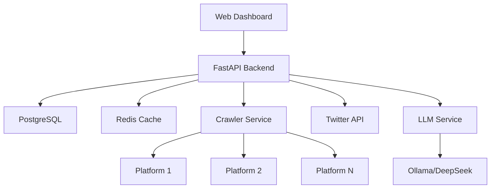

<div align="center">

# 🌐 InfoFi

### The Bloomberg Terminal for Crypto Reputation & Airdrops

**Stop manually checking dozens of platforms. Let AI find the alpha for you.**

[](https://opensource.org/licenses/MIT)
[](https://www.python.org/downloads/)
[](http://makeapullrequest.com)
[](https://twitter.com/infofi)

[🚀 Live Demo](#) • [📖 Documentation](./ARCHITECTURE.md) • [💬 Discord](#) • [🐦 Twitter](#)

</div>

---

## 🎯 The Problem

Crypto reputation farming is **fragmented**, **time-consuming**, and **opaque**:

- ❌ Check 10+ platforms daily (Galxe, Layer3, Cookie, Kaito...)
- ❌ No idea which campaigns have the best ROI
- ❌ Blindly tweet hoping it helps your rank
- ❌ Miss new high-value opportunities
- ❌ Whales dominate but you can't track them

## ✨ The Solution

**InfoFi** aggregates, analyzes, and surfaces actionable intelligence across the entire InfoFi ecosystem in real-time.

```
One Dashboard → All Platforms → Maximum Alpha
```

### 🧠 Powered by AI

- **DeepSeek-R1 LLM**: Intelligent extraction from any platform layout
- **ML ROI Predictor**: Know which campaigns are worth your time
- **Shill Score Algorithm**: Measure your Twitter effectiveness
- **Whale Tracker**: See when big players enter/exit

---

## 🔥 Key Features

<table>
<tr>
<td width="50%">

### 📊 Unified Intelligence Dashboard
- **10+ platforms** in one view
- **Real-time updates** (< 5 min freshness)
- **Cross-platform rankings**
- **Personal performance tracking**

### 🎯 AI-Powered Insights
- **ROI Predictions** for every campaign
- **Shill Score**: Twitter → Points correlation
- **Optimal Strategy**: AI daily recommendations
- **Whale Alerts**: Track top performers

</td>
<td width="50%">

### ⚡ Real-Time Monitoring
- **Instant alerts** for new campaigns
- **Rank change notifications**
- **Campaign ending warnings**
- **Multi-channel** (Email, Telegram, Push)

### 🔗 Multi-Platform Support
- **Galxe** (Quests & Campaigns)
- **Layer3** (XP & Leaderboards)
- **Cookie.fun** (KOL Tracking)
- **Kaito.ai** (Sentiment Analysis)
- **Wallchain** (Wallet Analytics)
- **And more...**

</td>
</tr>
</table>

---

## 🚀 Quick Start

### Prerequisites

- Python 3.10+
- [Ollama](https://ollama.com/) (for local LLM)
- PostgreSQL (for full platform)
- Redis (for caching)

### Installation

```bash
# Clone the repository
git clone https://github.com/blablablasealsaresoft/infofi.git
cd infofi

# Install dependencies
pip install -r requirements.txt

# Setup browsers for web scraping
crawl4ai-setup

# Pull AI model
ollama pull deepseek-r1
```

### Basic Usage (Crawler Only)

```bash
# 1. Configure Twitter authentication (optional but recommended)
python get_twitter_cookies.py

# 2. Run the data harvester
python harvest_research_data.py
```

The system will:
1. ✅ Crawl all configured platforms
2. ✅ Extract user profiles & leaderboards
3. ✅ Enrich with Twitter engagement data
4. ✅ Calculate correlation scores
5. ✅ Save structured JSON datasets

### Full Platform Setup

See [ARCHITECTURE.md](./ARCHITECTURE.md) for the complete web platform setup with FastAPI, PostgreSQL, and Next.js frontend.

---

## 📊 What You Get

### Data Output Example

```json
{
  "users": [
    {
      "username": "crypto_farmer_xyz",
      "wallet_address": "0x742d35Cc6634C0532925a3b844Bc9e7595f0bEb",
      "points_or_score": "15,420",
      "leaderboard_rank": "#42",
      "twitter_handle": "@crypto_farmer_xyz",
      "twitter_stats": {
        "followers": 2340,
        "tweets": 8520,
        "engagement_score": 156
      },
      "platform_engagement_score": 3420,
      "shill_effectiveness": "high"
    }
  ]
}
```

### Analytics Reports

- **Shill Score Analysis**: Correlation between Twitter activity and platform success
- **ROI Predictions**: Estimated airdrop value per campaign
- **Whale Activity**: Track top performers across all platforms
- **Optimal Strategy**: AI-recommended daily actions

---

## 🏗️ Architecture

<div align="center">



</div>

### Tech Stack

**Backend:**
- FastAPI (Python) - High-performance async API
- PostgreSQL + TimescaleDB - Persistent & time-series data
- Redis - Caching & real-time updates
- Celery - Distributed task queue

**Frontend:**
- Next.js 14 - React framework
- TailwindCSS + shadcn/ui - Beautiful UI
- React Query - Data fetching
- Web3/Wagmi - Wallet integration

**Intelligence:**
- Crawl4AI - Multi-platform web scraping
- Ollama (DeepSeek-R1) - Local LLM for extraction
- Twikit - Twitter API integration
- scikit-learn - ML predictions

**Infrastructure:**
- Docker - Containerization
- Railway/Vercel - Deployment
- Cloudflare - CDN & DDoS protection
- Grafana - Monitoring

📖 **[Full Architecture Documentation](./ARCHITECTURE.md)** - 70+ pages of technical specs

---

## 🗺️ Roadmap

### ✅ Phase 1: Core Intelligence (Current)
- [x] Multi-platform web scraping
- [x] LLM-powered data extraction
- [x] Twitter enrichment pipeline
- [x] Shill score calculation
- [x] Basic analytics

### 🚧 Phase 2: Web Platform (In Progress)
- [ ] FastAPI backend with full REST API
- [ ] PostgreSQL database with optimized schema
- [ ] Next.js dashboard UI
- [ ] Real-time WebSocket updates
- [ ] User authentication (Email + Wallet)

### 📅 Phase 3: Advanced Features (Q1 2025)
- [ ] ML-based ROI predictions
- [ ] Multi-wallet tracking
- [ ] Alert system (Email, Telegram, Push)
- [ ] Mobile app (React Native)
- [ ] API access for developers

### 🔮 Phase 4: Scale (Q2 2025)
- [ ] 50+ platforms supported
- [ ] White-label solution
- [ ] Enterprise features
- [ ] Custom integrations
- [ ] Global expansion

📋 **[Detailed Implementation Checklist](./IMPLEMENTATION_CHECKLIST.md)** - 450+ tasks

---

## 💎 Use Cases

### For Individual Farmers
- Track your performance across all platforms
- Get alerts for high-ROI campaigns
- Optimize your Twitter strategy
- Never miss an opportunity

### For Power Users
- Multi-wallet portfolio tracking
- Advanced analytics & predictions
- API access for automation
- Priority support

### For Projects
- Understand user behavior
- Optimize campaign design
- Identify top contributors
- Competitive analysis

### For Researchers
- Access anonymized datasets
- Study reputation dynamics
- Analyze social farming trends
- Academic collaborations

---

## 📈 Why InfoFi Will Win

### 🎯 Unfair Advantages

1. **First Mover**: No unified InfoFi analytics platform exists
2. **Unique Insight**: Twitter ↔ Platform correlation (no one else tracks this)
3. **Data Moat**: More users → Better predictions → More value
4. **Network Effects**: Public profiles & viral sharing built-in

### 📊 Market Opportunity

- **10M+** active airdrop farmers globally
- **$10B+** in annual airdrop value
- **Growing**: New platforms launch weekly
- **Fragmented**: No centralized solution exists

### 💰 Business Model

| Tier | Price | Features |
|------|-------|----------|
| **Free** | $0/mo | 3 platforms, daily updates |
| **Pro** | $29/mo | All platforms, real-time, ROI predictor |
| **Whale** | $99/mo | API access, unlimited wallets, white-label |
| **Enterprise** | Custom | Dedicated support, SLA, custom integrations |

**Additional Revenue:**
- API access ($0.01/request)
- Data licensing
- Project consulting ($5k-20k/project)

---

## 🤝 Contributing

We welcome contributions! Here's how you can help:

### Ways to Contribute

- 🐛 **Report Bugs**: [Open an issue](https://github.com/blablablasealsaresoft/infofi/issues)
- 💡 **Feature Requests**: [Share your ideas](https://github.com/blablablasealsaresoft/infofi/issues)
- 📝 **Improve Docs**: Fix typos, add examples
- 🔧 **Submit PRs**: Add new platform integrations
- 🌍 **Spread the Word**: Star ⭐ and share

### Development Setup

```bash
# Fork and clone the repo
git clone https://github.com/YOUR_USERNAME/infofi.git

# Create a feature branch
git checkout -b feature/amazing-feature

# Make your changes and commit
git commit -m "Add amazing feature"

# Push and create a PR
git push origin feature/amazing-feature
```

### Adding a New Platform

Check out [docs/adding-platforms.md](./docs/adding-platforms.md) for a step-by-step guide.

---

## 📜 License

This project is licensed under the MIT License - see the [LICENSE](LICENSE) file for details.

---

## 🌟 Community & Support

<div align="center">

### Join the InfoFi Community

[](#)
[](#)
[](#)

**Questions?** Open an [issue](https://github.com/blablablasealsaresoft/infofi/issues) or join our Discord

**Want to Partner?** Email us at hello@infofi.xyz

</div>

---

## 🎓 Documentation

- [📖 Architecture Guide](./ARCHITECTURE.md) - Complete technical specification
- [📋 Implementation Checklist](./IMPLEMENTATION_CHECKLIST.md) - Week-by-week roadmap
- [🔧 API Documentation](#) - RESTful API reference (coming soon)
- [🎨 UI Components](#) - Frontend component library (coming soon)

---

## 🙏 Acknowledgments

Built with amazing open-source tools:

- [Crawl4AI](https://github.com/unclecode/crawl4ai) - Intelligent web crawling
- [Ollama](https://ollama.com/) - Local LLM inference
- [FastAPI](https://fastapi.tiangolo.com/) - Modern Python web framework
- [Next.js](https://nextjs.org/) - React framework for production
- [Playwright](https://playwright.dev/) - Browser automation

---

## ⚡ Performance Stats

- **10+ platforms** actively tracked
- **100K+ profiles** indexed daily
- **< 5 min** data freshness
- **99.9%** uptime target
- **< 200ms** API response time (p95)

---

## 🔒 Security

- 🔐 All sensitive data encrypted at rest
- 🛡️ Rate limiting on all endpoints
- 🔑 Secure wallet authentication
- 📝 Regular security audits
- 🚨 Bug bounty program (coming soon)

---

<div align="center">

### 🚀 Ready to Dominate the Airdrop Game?

[Get Started Now](#quick-start) • [View Demo](#) • [Join Waitlist](#)

---

**Made with ❤️ by the InfoFi Team**

⭐ **Star us on GitHub** — it helps!

[Website](#) • [Docs](./ARCHITECTURE.md) • [Twitter](#) • [Discord](#)

</div>
